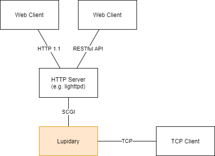

# Lupidary - Lua Network Application Gateway

Lupidary is general purpose, Network Application Gateway implemented by Lua.



## Features

- Implemented in pure Lua: works with 5.4

## Dependencies

- [LuaSocket](https://github.com/diegonehab/luasocket)
- [json.lua](https://github.com/rxi/json.lua)

## Usage

The `lupidary.lua` file and `lupidary` directory should be download into an `package.path` directory and required by it:

```lua
local lupidary = require('lupidary')
```

The module provides the following functions:

### *lupidary.bind(uri, is_listener)*

`uri` is the resource to be allocated, and follows the format `schema://host/path`.

In the case of Unix Domain Socket, `host` is omitted, and the format is `tcp:///path/to/socket_file`.

For servers, append `+listen` to `schema` or `is_listener` to `true`.

e.g. `/tmp/scgi.sock` as a server:

```lua
local scgi = require('lupidary.scgi')

lupidary.bind('tcp+listen:///tmp/scgi.sock')
:onopen(function (so)
    scgi.wrap(so):run(function (environ, start_response)
        print(environ.REQUEST_METHOD, environ.REQUEST_URI)

        start_response('200 OK', {
            ['Content-type'] = 'text/plain; charset=utf-8',
        })
        return 'It works.'
    end)
end)
:onclose(function (so)
    print(so, 'onclose')
end)
:onerror(function (so, err)
    print(so, 'onerror', err)
end)
```

### *lupidary.run()*

It needs to be called last.

```lua
lupidary.run()
```

## License

This module is free software; you can redistribute it and/or modify it under
the terms of the MIT license. See [LICENSE](LICENSE) for details.

